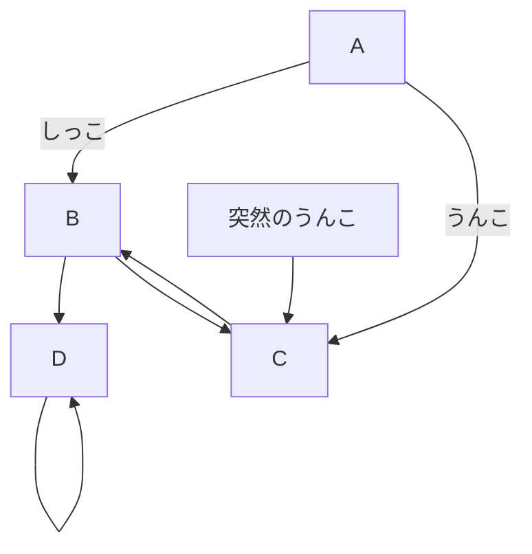
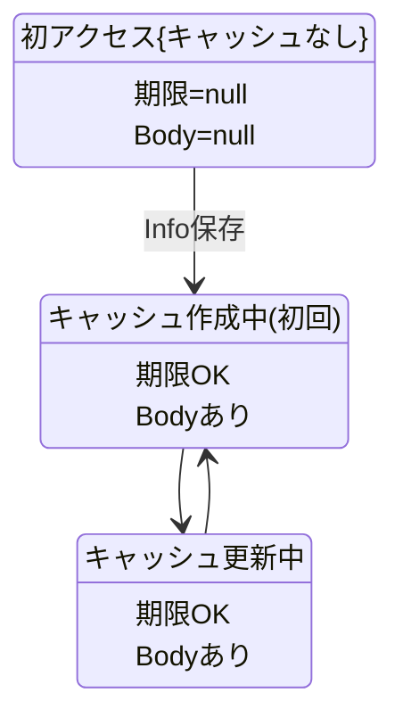
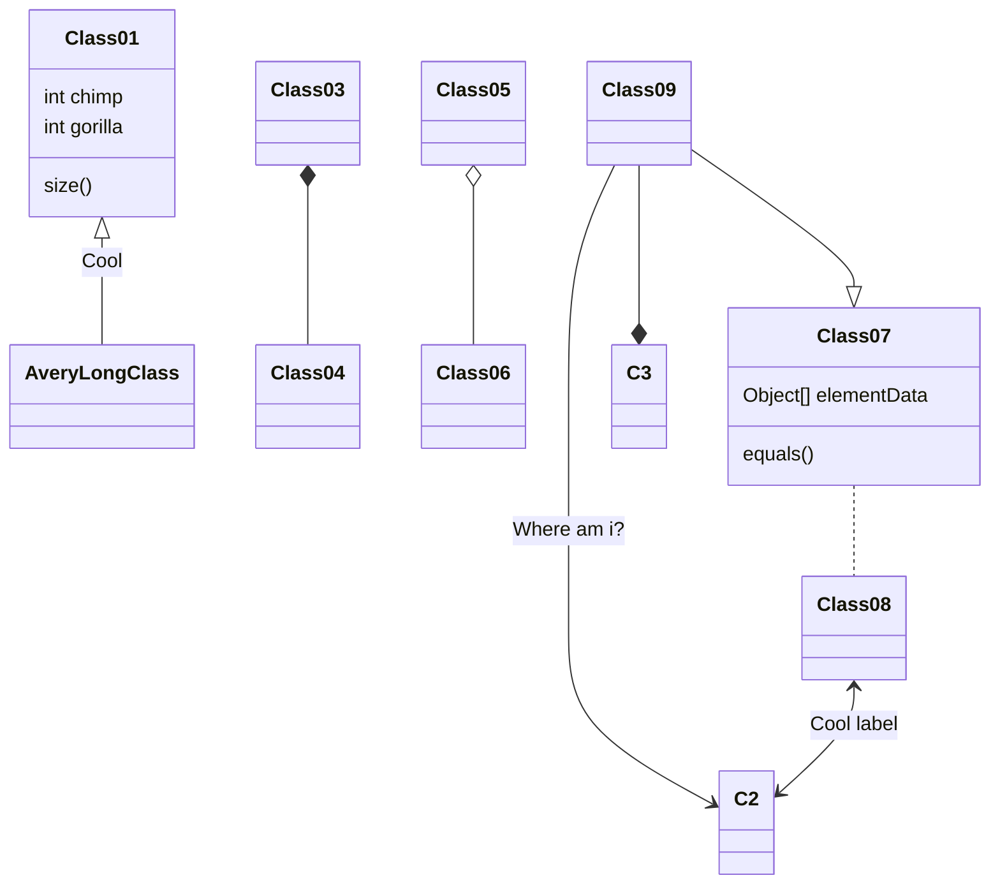

zunproxy

```mermaid
graph TD
    A -->|しっこ| B -->D -->D
    A -->|うんこ| C -->B -->C
    突然のうんこ --> C
```

```mermaid
stateDiagram
a:初アクセス{キャッシュなし}
a:期限=null
a:Body=null

b:キャッシュ作成中(初回)
b:期限OK
b:Bodyあり

c:キャッシュ更新中
c:期限OK
c:Bodyあり

a --> b:Info保存
b --> c
c --> b
```

```mermaid
classDiagram
    Class01 <|-- AveryLongClass : Cool
    Class03 *-- Class04
    Class05 o-- Class06
    Class07 .. Class08
    Class09 --> C2 : Where am i?
    Class09 --* C3
    Class09 --|> Class07
    Class07 : equals()
    Class07 : Object[] elementData
    Class01 : size()
    Class01 : int chimp
    Class01 : int gorilla
    Class08 <--> C2: Cool label
```

- dsa
- dsa
- dsa

1. dsa
2. aaaadsa
   1. ds
3. dsa
4. ほげ

# hoge

## hoho3

## ho `ge` hoge

# あいう